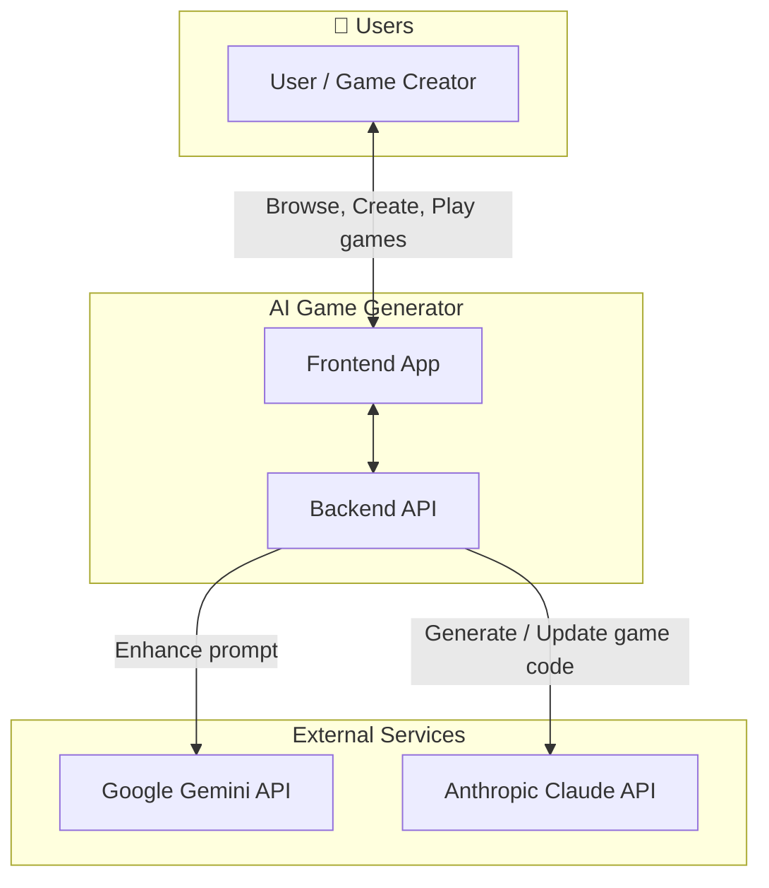
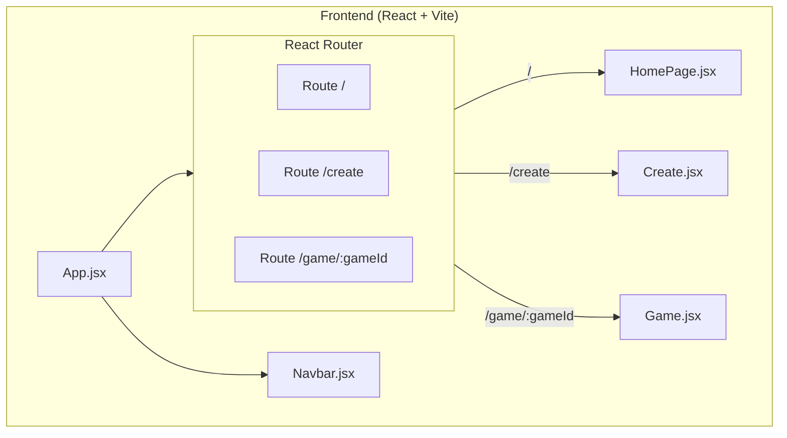
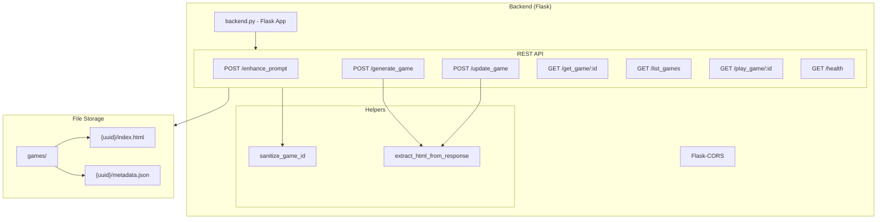
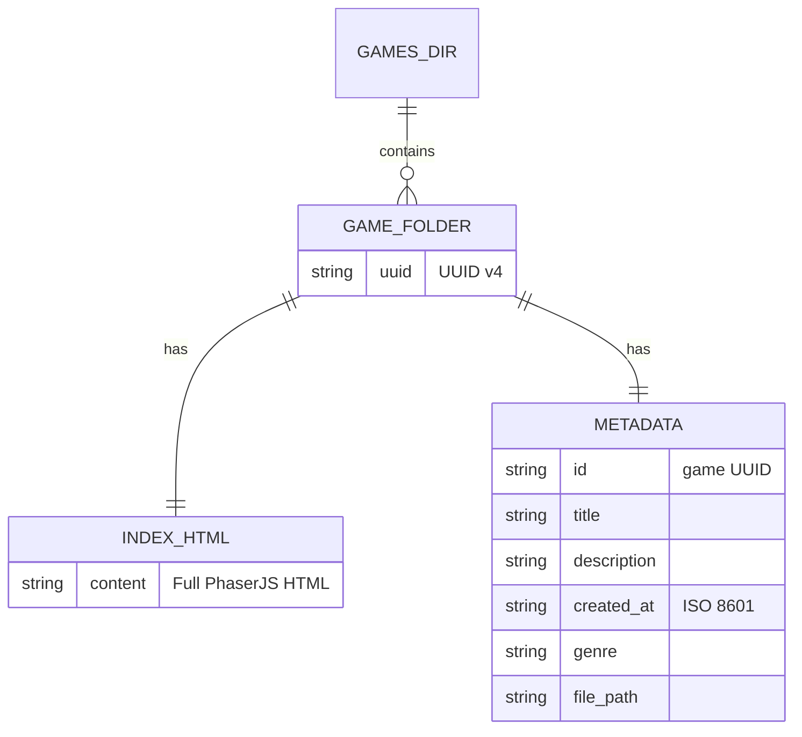
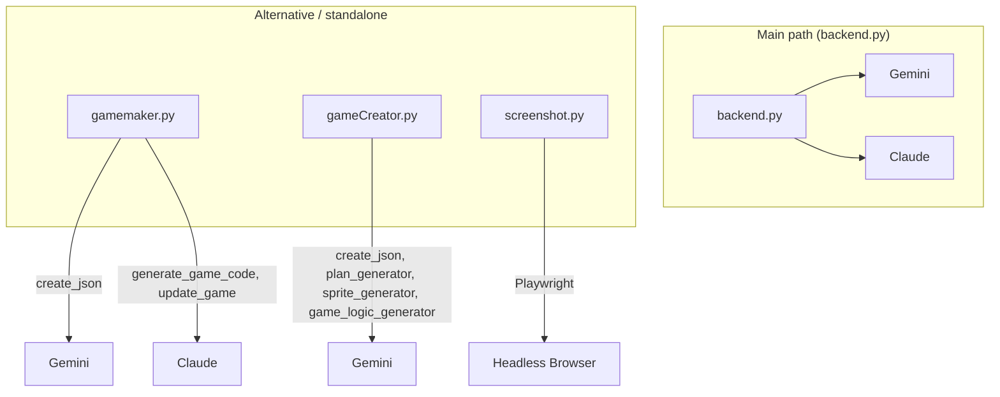
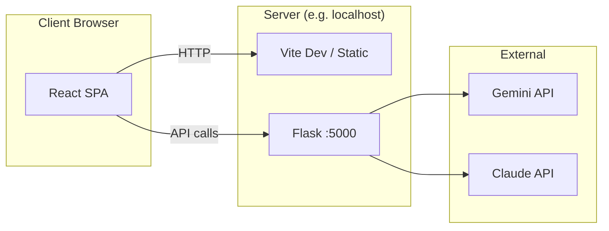

# AI Game Generator — System Architecture

This document describes the system architecture of the AI Game Generator using Mermaid diagrams.

---

## 1. High-Level System Context



---

## 2. Frontend Architecture



**Frontend stack:** React 19, Vite 6, React Router 7, Tailwind CSS 4, Lucide React.

---

## 3. Backend Architecture



---

## 4. AI Pipeline (Main Flow)

```mermaid
flowchart LR
    subgraph Step1["1. Describe"]
        P[User Prompt]
    end

    subgraph Step2["2. Enhance"]
        EP[POST /enhance_prompt]
        Gemini[Gemini 2.0 Flash]
        EP --> Gemini
        Gemini --> Enhanced[Enhanced Concept JSON]
    end

    subgraph Step3["3. Generate"]
        GG[POST /generate_game]
        Claude[Claude Sonnet 4]
        GG --> Claude
        Claude --> HTML[PhaserJS HTML]
    end

    subgraph Step4["4. Persist & Play"]
        Save[Save to games/{uuid}/]
        Play[GET /play_game/:id]
        Save --> Play
    end

    P --> EP
    Enhanced --> GG
    HTML --> Save
```

---

## 5. Component Interaction (Create Flow)

```mermaid
sequenceDiagram
    participant User
    participant Create as Create.jsx
    participant Backend as backend.py
    participant Gemini as Gemini API
    participant Claude as Claude API
    participant FS as File System

    User->>Create: Enter game idea
    Create->>Backend: POST /enhance_prompt { prompt }
    Backend->>Gemini: Refine game concept
    Gemini-->>Backend: Enhanced description
    Backend-->>Create: { title, description, genre, ... }

    User->>Create: Edit (optional) → Generate
    Create->>Backend: POST /generate_game { enhanced_prompt }
    Backend->>Claude: Generate PhaserJS HTML
    Claude-->>Backend: HTML code
    Backend->>FS: Write games/{uuid}/index.html, metadata.json
    Backend-->>Create: { game_id, html, title }

    User->>Create: Optional: feedback → Update
    Create->>Backend: POST /update_game { game_id, feedback, current_html }
    Backend->>Claude: Update game from feedback
    Claude-->>Backend: Updated HTML
    Backend->>FS: Overwrite index.html (if game_id)
    Backend-->>Create: { html }
```

---

## 6. Data Model (Game Storage)



**Path layout:** `backend/games/{uuid}/index.html` and `backend/games/{uuid}/metadata.json`.

---

## 7. Alternative / Legacy Modules (Not in Main Request Path)



- **gamemaker.py:** Standalone script; Gemini for JSON config, Claude for single HTML game (different models/prompts than backend).
- **gameCreator.py:** Multi-step Gemini-only pipeline (BootScene + GameScene, plan → sprites → logic); outputs to local HTML file.
- **screenshot.py:** Playwright-based screenshot of game HTML (utility, not wired to Flask routes).

---

## 8. Deployment View



**Typical dev:** Frontend: `npm run dev` (Vite); Backend: `python backend/backend.py` (Flask on port 5000). Frontend uses `http://127.0.0.1:5000` for all game-related API calls.

---

## 9. Security Notes (Architecture)

- **Game ID:** Validated with `sanitize_game_id()` (UUID format) to avoid path traversal.
- **CORS:** Enabled via Flask-CORS for frontend origin.
- **API keys:** Gemini and Claude keys are currently in backend code; should be moved to environment variables (e.g. `.env`) and never committed.

---

## Summary

| Layer        | Technology        | Responsibility                                  |
|-------------|-------------------|--------------------------------------------------|
| **Frontend** | React, Vite       | UI, routing, call backend APIs, render game in iframe |
| **Backend**  | Flask             | REST API, call Gemini/Claude, read/write `games/` |
| **AI**       | Gemini, Claude    | Prompt enhancement (Gemini), game HTML generation/update (Claude) |
| **Storage**  | File system       | One folder per game: `index.html` + `metadata.json` |

The main user journey is: **Describe (prompt) → Enhance (Gemini) → Generate (Claude) → Save → Play / Update**, with the frontend driving the flow and the backend orchestrating AI and storage.
